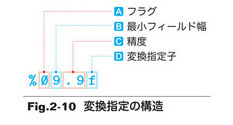

# 変換指定

フラグ: 0が指定されていると、数値の前に余白があるときに0をつめて表示する。
最小フィールド幅: 最低限の表示文字数の指定。
精度: 表示する最小の桁数の指定。
変換指定子:
    d: int型の整数を10進数で表示することの指定。
    f: double型の浮動小数点数を10進数で表示することの指定。

# まとめ
演算子: + *などの記号
単項演算子、2項演算子、3項演算子: オペランドの個数によって分類される。

暗黙の型変換: 演算の対象となるオペランドの型が異なるとき、大きい型に変換された上で演習が行われる。
